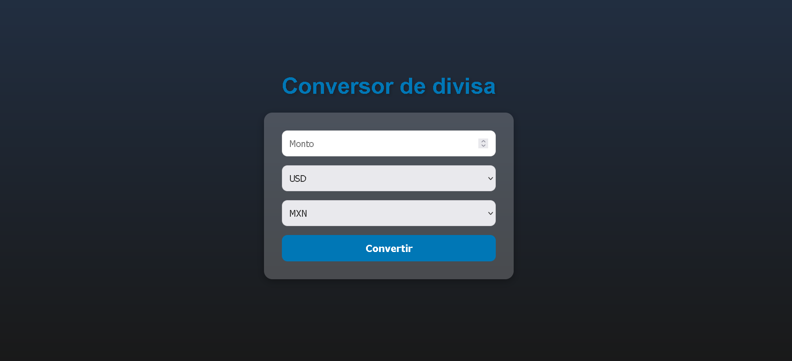

# Conversor de Monedas 💱

Este es un proyecto de conversor de monedas simple creado con React y desplegado en GitHub Pages. Permite convertir valores entre diferentes monedas en tiempo real utilizando una API de conversión de monedas.

## 📸 Capturas de Pantalla

## 🚀 Características

- Conversión de valores entre monedas populares (USD, EUR, MXN)
- Consumo de una API de conversión de monedas para obtener las tasas de cambio en tiempo real
- Diseño completamente responsivo y adaptado a diferentes dispositivos

## 🛠️ Tecnologías Usadas

- **React**: Biblioteca de JavaScript para construir la interfaz de usuario
- **SASS**: Preprocesador CSS para los estilos
- **Vite**: Herramienta de desarrollo rápida para aplicaciones de React
- **Exchange Rate API**: Proporciona las tasas de cambio en tiempo real

## 📂 Estructura del Proyecto

- `src/`
  - `assets/` - Imágenes y otros archivos de recursos
    - `mapa.jpg` - Imagen de fondo del mapa (opcional)
  - `components/` - Componentes de React
    - `Conversor.jsx` - Componente principal para la conversión de monedas
  - `styles/` - Archivos de estilos en SASS
    - `Conversor.scss` - Estilos del componente `Conversor`
  - `App.jsx` - Componente principal de la aplicación
  - `main.jsx` - Punto de entrada principal de React

## 📄 Licencia

Este proyecto está bajo la Licencia MIT. Consulta el archivo [LICENSE](./LICENSE) para obtener más información.

## 📞 Contacto

**Nicolás** - [pootnicolas1@gmail.com](mailto:tu-email@example.com)

